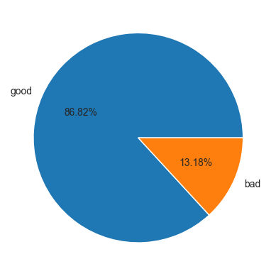
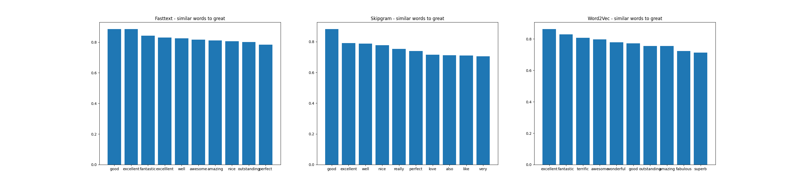
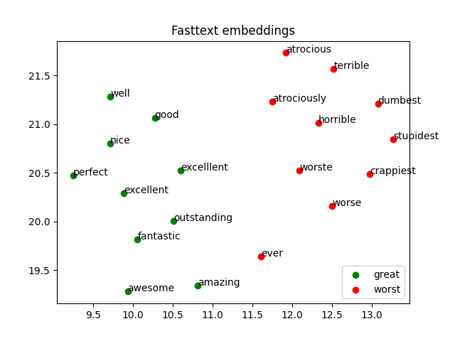
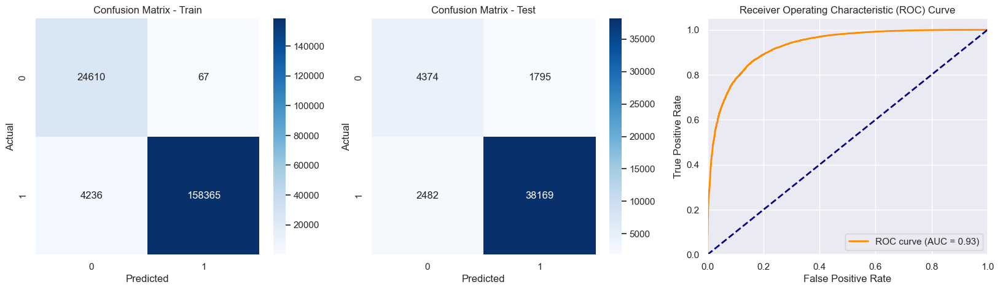
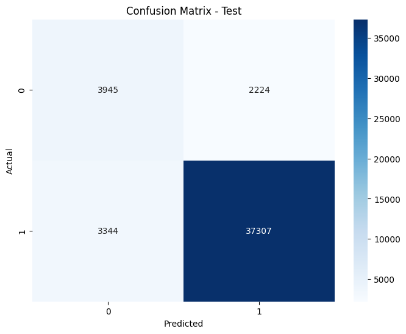
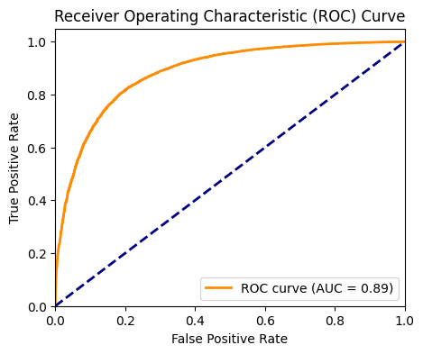
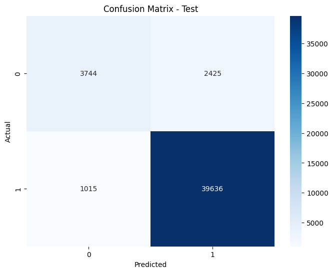
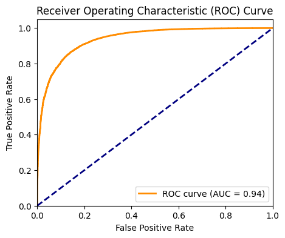
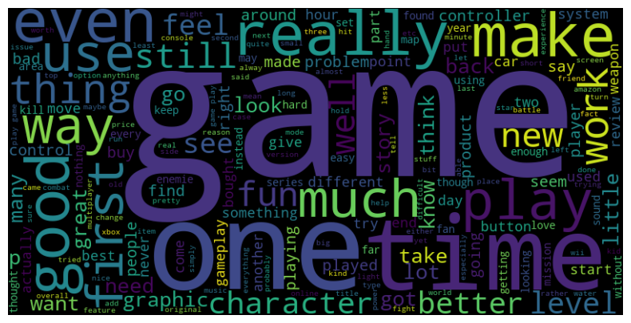

# Amazon-Sentiment-Analysis

## Overview

Amazon Sentiment Analysis is a classification task to identify the sentiment of the reviews for products in Amazon. The reviews are grouped to be either good reviews or bad reviews. The review texts are preprocessed using Natural language processing and embeddings are created for each of the reviews using Word2Vec and Fasttext. These embeddings are later used to train a Machine learning model, Convolution Neural Network and Recurrent Neural Networks. The performance of these models are compared to identify the best combination of embeddings and model. 

## About Dataset

The dataset is taken from the [Amazon datasets available online(https://cseweb.ucsd.edu/~jmcauley/datasets/amazon/links.html). Out of all those, three different review categories are identified, which are Video games, Patio Lawn & garden and Automotive. These three datasets are merged to build a combined `reviews.csv` dataset which was used for further steps.

The dataset has both Machine learning and non machine learning attributes where the `overall` column is the target vector with values rating from 1 to 5 indicating the product rating given by the user. Out of these, the reviews with rating 3 are dropped, 5 start and 4 star reviews are grouped as good reviews and 1 start and 2 star reviews are grouped as bad reviews. The final distribution of target vector classes is shown below as a pie chart.

## IDE and Environment

- Programming Language : Python
- IDE : Jupyter Notebooks
- Environment : environment.yml file included

## Data Cleaning and Data preprocessing

After dropping the non machine learning attributes, missing reviews and perfroming feature engineering the review text is preprocessed using regular expressions, NLTK library while also removing rare words and stop words. There were few reviews without any remaining text after preprocessing which were also dropped. The final preprocessed data is saved as `preprocessed.csv`.

## Embeddings

Using gensim and fasttext library, I created 3 different 100 embeddings using CBOW, Skipgram and Fasttext where each sentence embedding has 100 dimension vectors which are the mean of all the word vectors present in the review. Therefore, we have 3 different embedding dataframes for all the processed reviews.

## Visualizations

- The following bar plot shows us the words similar to "great" and their respective similarity scores.

- Similarly, the closest words to "worst" are identified and stored in a dataframe with along with the above for each of the 3 different embeddings. The following is just one example of dimension reduced embeddings to plot words using scatter plot.

- Other similar plots can be found in the figs folder.

## Using XGBoost

I used XGBClassifier on these embeddings with hyperparameter tuning using GridSearchCV while taking advantage of hyperparamters that help for data with imbalanced target classes. The following is the train, test confusion matrix along with ROC AUC curve results for Fasttext embeddings.

## Using CNN

I used Convolutional Neural networks which comprises a 1D convolutional layer with 128 filters and ReLU activation, followed by max pooling. The flattened output is fed into two dense layers with 128 and 64 neurons, respectively, both activated by ReLU, and a final sigmoid output layer for binary classification (either good or bad). The following is the best outcome for CNN with Fasttext. 

## Using RNN

I used Recurrent Neural networks with an LSTM layer of 128 units, suitable for sequence modeling, followed by a dense layer with 64 neurons activated by ReLU. The architecture concludes with a single neuron dense layer with sigmoid activation, ideal for binary classification (either good or bad). The following is the best model out of all with Fasttext embeddings 

## Result Analysis

- Taking the best model i.e., RNN with Fasttext embeddings and further analyzing, I observed that the False Positives are not identified as bad reviews because of the fact there there were words like good, better, great appearing more number of times.

- However, for there was no conclusive evidence as to why the false negatives are not being classified good reviews. This final model is the best performing model with an ROC AUC score of 94%.

